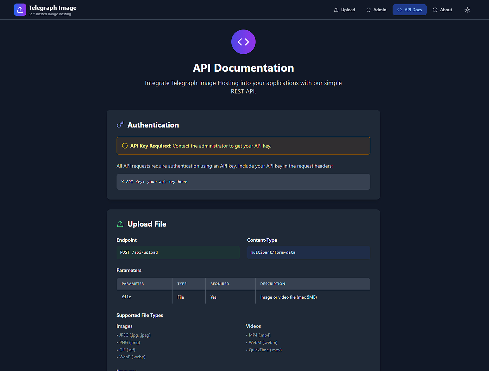

# Telegram Image Hosting

Instantly share images and video clips through Telegram while serving a polished web UI from Cloudflare Pages.

> **Live demo:** https://telemage.pages.dev/

## Preview


*Drop a file, watch it ship to Telegram, and grab the shareable link immediately.*


*Zoom, rotate, stream, or download from the dedicated preview page served by Cloudflare Functions.*


*Monitor rate limits, fingerprints, and API keys without leaving the browser.*


*Copy-and-paste examples for every endpoint the project exposes.*

## Highlights

- Upload once, deliver everywhere via Telegram's CDN-backed storage.
- Fast React SPA with local history only stored in your browser.
- Cloudflare Pages Functions handle uploads, previews, stats, and the admin API.
- Built-in dark mode, responsive layout, and keyboard-friendly navigation.

## Requirements

- Node.js 18+
- Cloudflare account with Pages + KV access
- Telegram bot token and chat (group or channel) where the files will land
- [`wrangler`](https://developers.cloudflare.com/workers/wrangler/install-and-update/) CLI (use `npx wrangler` if you prefer not to install globally)

## Environment variables

Create a `.dev.vars` file in the project root with the four required secrets:

```
TG_BOT_TOKEN=123456:abc-your-telegram-bot-token
TG_CHAT_ID=-1001234567890
ADMIN_USERNAME=admin
ADMIN_PASSWORD=super-secure-password
```

> Cloudflare Pages ignores `.env` files from the repository. You must add these values directly to the Pages project so the Functions can read them.

### Add the secrets on Cloudflare Pages

- **Dashboard:** Pages → *telegram-image-hosting* → Settings → Environment variables. Add the four keys for both **Preview** and **Production** environments.
- **CLI alternative:**

  ```bash
  npx wrangler pages project secret put TG_BOT_TOKEN
  npx wrangler pages project secret put TG_CHAT_ID
  npx wrangler pages project secret put ADMIN_USERNAME
  npx wrangler pages project secret put ADMIN_PASSWORD
  ```

  Wrangler prompts for each value and stores it for the selected project/environment pair.

### Ensure the KV namespace is bound everywhere

Add the `app_data` namespace to each environment block in `wrangler.toml`:

```toml
[[env.production.kv_namespaces]]
binding = "app_data"
id = "<your-production-namespace-id>"

[[env.preview.kv_namespaces]]
binding = "app_data"
id = "<your-preview-namespace-id>"
```

The IDs are returned by `npx wrangler kv namespace create app_data`. Without the per-environment bindings the Functions will fail to read usage stats or API keys during deploy.

## Run locally

```bash
# 1. Clone and install dependencies
git clone https://github.com/tas33n/Telegram-image-hosting.git
cd telegram-image-hosting
npm install

# 2. Build once so Wrangler sees the static assets
npm run build

# 3. Start Pages Functions + the Vite dev server
npx wrangler pages dev -- npm run dev -- --host
```

Visit http://127.0.0.1:8788 to use the complete app (frontend + functions). Stop with `Ctrl+C` when finished.

## Deploy with Wrangler from your machine

```bash
# Authenticate once
npx wrangler login

# Ensure KV namespace IDs are set in wrangler.toml
# (run `npx wrangler kv namespace create app_data` if you haven't yet)

# Build and deploy
npm run build
npx wrangler pages deploy dist
```

Wrangler will prompt for Preview or Production and upload both the static bundle and the server functions.

## Deploy on Cloudflare Pages (GitHub integration)

1. Fork or clone the repo into your own GitHub account.
2. In the Cloudflare dashboard, go to **Pages → Create a project → Connect to Git**.
3. Select the repository.
4. Framework preset: **Vite** (or leave defaults), Build command: `npm run build`, Output directory: `dist`.
5. Under **Environment variables**, add the four keys listed above.
6. Save & deploy. Cloudflare will run the build and publish a Preview URL; promote it to Production when you're ready.

Future commits to your main branch will trigger new deployments automatically.

## API overview

| Method | Endpoint | Notes |
| --- | --- | --- |
| `POST` | `/api/upload` | Multipart upload (`file` field). Honors optional `X-API-Key` header for trusted clients. |
| `GET` | `/file/:encodedId` | Streams the original asset from Telegram. Accepts `?a=view` for the preview UI. |
| `POST` | `/api/auth` | Returns a session token when the admin username/password pair is correct. |
| `GET/DELETE` | `/api/stats` | Admin-only usage stats plus fingerprint pruning. |
| `GET/POST/DELETE` | `/api/api-keys` | Admin-only API key management. |

The admin SPA consumes the same endpoints. Check the in-app **API Docs** page for concrete `curl` examples.

## Project layout

- `src/` – React application, hooks, and UI components.
- `functions/` – Cloudflare Pages Functions (API, file proxy, utilities).
- `dist/` – Build output uploaded by Wrangler (generated).
- `docs/previews/` – Static preview images used in this README.

## Contributing

Issues and pull requests are welcome. Please run `npm run lint` and `npm run typecheck` before submitting changes.

## License

MIT License. See [`LICENSE`](LICENSE) for details.

---

## Acknowledgements

Inspired by the community project [cf-pages/Telegraph-Image](https://github.com/cf-pages/Telegraph-Image), which paved the way for using Telegram as edge-friendly storage.

Developed by [Tas33n](https://github.com/tas33n).
